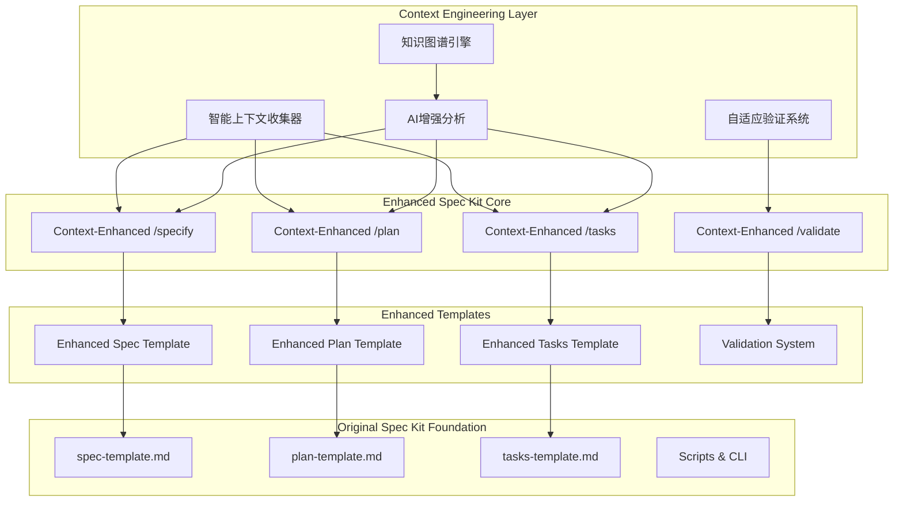

# Context Engineering Integration Guide

**深度融合方案**: Spec Kit + Context Engineering 完整工作流程
**设计理念**: 以Spec Kit为骨架，用Context Engineering丰富血肉

## 融合架构概览

### 系统架构图


### 核心融合原则
```yaml
深度融合原则:
  1. 无缝集成:
     - 保持Spec Kit原有工作流程
     - 增强功能完全可选
     - 渐进式启用和配置
     - 向后兼容性保证
  
  2. 智能增强:
     - 自动上下文感知
     - 智能分析和建议
     - 验证驱动的质量保证
     - 持续学习和优化
  
  3. 自适应深度:
     - 基于项目复杂度调整
     - 基于团队能力匹配
     - 基于时间压力平衡
     - 基于质量要求优化
  
  4. 验证循环:
     - 多层次质量验证
     - 智能问题识别
     - 自动修复建议
     - 持续改进反馈
```

## 完整工作流程

### 阶段0: 环境准备和上下文收集
```yaml
初始化阶段:
  项目初始化:
    命令: "specify init [project-name] --context-enhanced"
    功能:
      - 创建标准Spec Kit项目结构
      - 初始化Context Engineering配置
      - 启动智能上下文收集器
      - 建立项目知识图谱基础
  
  上下文收集:
    自动触发:
      - 项目结构分析
      - 技术栈识别
      - 现有代码分析
      - 团队能力评估
    
    手动增强:
      命令: "/context collect --level=deep"
      功能:
        - 深度代码库分析
        - 外部最佳实践研究
        - 相似项目案例收集
        - 行业标准和规范整合
  
  环境配置:
    智能配置:
      - 基于项目特征的模板选择
      - 基于团队能力的验证级别设置
      - 基于复杂度的分析深度配置
      - 基于时间压力的效率平衡
```

### 阶段1: 增强功能规范 (Enhanced /specify)
```yaml
传统流程增强:
  输入处理:
    - 自然语言功能描述
    - 可选的上下文提示
    - 复杂度和优先级指示
    - 特殊要求和约束
  
  Context Engineering增强:
    上下文预分析:
      - 功能复杂度智能评估
      - 相似功能模式识别
      - 技术可行性预判
      - 风险和挑战预测
    
    智能需求解析:
      - 隐含需求推理
      - 边界情况识别
      - 非功能需求补充
      - 用户体验考虑
    
    上下文丰富:
      - 相关最佳实践集成
      - 技术约束和机会识别
      - 集成点和依赖分析
      - 测试策略预规划
  
  输出增强:
    标准输出:
      - 功能规范文件 (spec.md)
      - 分支创建和初始化
      - 基础项目结构
    
    Context Engineering增强输出:
      - 上下文分析报告
      - 智能澄清问题列表
      - 技术风险评估
      - 实施复杂度预估
      - 相关资源推荐

使用示例:
  基础使用:
    "/specify 用户认证系统，支持邮箱登录和双因素认证"
  
  增强使用:
    "/specify [DEEP] 分布式用户认证系统，需要支持SSO和微服务架构"
  
  自定义使用:
    "/specify 用户认证 --context=security,performance --team=senior"
```

### 阶段2: 增强实施规划 (Enhanced /plan)
```yaml
传统流程增强:
  输入分析:
    - 功能规范深度解析
    - 澄清结果整合
    - 技术约束识别
    - 业务目标对齐
  
  Context Engineering增强:
    深度技术分析:
      - 架构模式智能选择
      - 技术栈优化建议
      - 性能和扩展性设计
      - 安全和合规考虑
    
    智能设计生成:
      - 数据模型智能设计
      - API接口优化设计
      - 集成策略规划
      - 测试策略制定
    
    验证驱动设计:
      - 设计一致性验证
      - 可实现性评估
      - 风险识别和缓解
      - 质量门控设置
  
  输出增强:
    标准输出:
      - 实施计划 (plan.md)
      - 技术研究 (research.md)
      - 数据模型 (data-model.md)
      - API合约 (contracts/)
      - 开发指南 (quickstart.md)
    
    Context Engineering增强输出:
      - 架构决策记录
      - 技术选型分析
      - 风险缓解策略
      - 性能优化建议
      - 安全加固方案

使用示例:
  基础使用:
    "/plan"
  
  深度分析:
    "/plan --analysis=deep --focus=architecture,security"
  
  特定关注:
    "/plan --optimize=performance --validate=strict"
```

### 阶段3: 增强任务生成 (Enhanced /tasks)
```yaml
传统流程增强:
  设计分析:
    - 所有设计文档深度解析
    - 依赖关系智能识别
    - 实施复杂度评估
    - 团队能力匹配
  
  Context Engineering增强:
    智能任务分解:
      - 基于复杂度的任务粒度
      - 上下文感知的任务内容
      - 验证驱动的任务设计
      - 风险预警的任务规划
    
    依赖优化:
      - 多维依赖关系分析
      - 关键路径优化
      - 并行机会识别
      - 资源分配优化
    
    质量保证:
      - 任务完整性验证
      - 验收标准明确化
      - 测试策略集成
      - 持续集成规划
  
  输出增强:
    标准输出:
      - 任务列表 (tasks.md)
      - 依赖关系图
      - 执行顺序建议
    
    Context Engineering增强输出:
      - 智能任务分类
      - 风险评估和缓解
      - 并行执行建议
      - 里程碑规划
      - 资源需求分析

使用示例:
  基础使用:
    "/tasks"
  
  优化执行:
    "/tasks --optimize=parallel --risk-analysis=true"
  
  团队适配:
    "/tasks --team=mixed --detail=high"
```

### 阶段4: 持续验证和优化 (Enhanced /validate)
```yaml
验证循环:
  自动验证:
    触发时机:
      - 文档创建或更新后
      - 代码提交后
      - 里程碑完成后
      - 用户主动请求
    
    验证内容:
      - 多层次质量检查
      - 一致性验证
      - 完整性评估
      - 可行性分析
  
  智能修复:
    问题识别:
      - 自动问题分类
      - 严重性评估
      - 影响范围分析
      - 修复优先级排序
    
    修复建议:
      - 自动修复尝试
      - 智能修复建议
      - 最佳实践推荐
      - 人工介入指导
  
  持续改进:
    学习反馈:
      - 验证结果分析
      - 修复效果评估
      - 用户满意度收集
      - 规则优化调整

使用示例:
  全面验证:
    "/validate --comprehensive"
  
  特定验证:
    "/validate spec.md --level=gold"
  
  自动修复:
    "/validate --auto-fix --report=detailed"
```

## 配置和自定义

### 项目级配置
```yaml
配置文件: .spec-kit/context-config.yml

基础配置:
  context_engineering:
    enabled: true
    default_level: "standard"  # basic, standard, deep, ultra
    auto_collect: true
    cache_enabled: true
  
  validation:
    enabled: true
    default_level: "silver"  # bronze, silver, gold, platinum
    auto_validate: true
    auto_fix: false
  
  intelligence:
    learning_enabled: true
    recommendation_enabled: true
    prediction_enabled: true
    optimization_enabled: true

项目特定配置:
  project:
    type: "web_application"  # web_app, mobile_app, api, library, etc.
    complexity: "medium"     # simple, medium, complex, enterprise
    risk_level: "medium"     # low, medium, high, critical
    team_size: "small"       # solo, small, medium, large
  
  team:
    experience_level: "mixed"  # junior, mixed, senior, expert
    domain_expertise: "medium" # low, medium, high
    preferred_depth: "balanced" # fast, balanced, thorough
  
  quality:
    standards: "industry"    # basic, industry, enterprise, custom
    test_coverage: "standard" # minimal, standard, comprehensive
    documentation: "detailed"  # minimal, standard, detailed
```

### 团队级配置
```yaml
配置文件: ~/.spec-kit/team-config.yml

团队偏好:
  workflow:
    preferred_commands: ["context-enhanced"]
    default_analysis_depth: "deep"
    auto_research: true
    parallel_optimization: true
  
  quality:
    validation_strictness: "high"
    auto_fix_enabled: true
    continuous_improvement: true
  
  learning:
    feedback_collection: true
    pattern_learning: true
    best_practice_sharing: true

技能配置:
  technical_skills:
    - javascript: "expert"
    - python: "intermediate"
    - react: "expert"
    - nodejs: "expert"
    - docker: "intermediate"
  
  domain_knowledge:
    - web_development: "expert"
    - api_design: "expert"
    - database_design: "intermediate"
    - security: "intermediate"
    - performance: "advanced"
```

### 全局配置
```yaml
配置文件: ~/.spec-kit/global-config.yml

系统配置:
  context_collector:
    cache_size: "1GB"
    update_frequency: "daily"
    external_research: true
    parallel_processing: true
  
  validation_engine:
    rule_updates: "auto"
    custom_rules: true
    learning_enabled: true
  
  ai_enhancement:
    model_updates: "auto"
    prediction_accuracy: "high"
    recommendation_quality: "high"

外部集成:
  research_sources:
    - github
    - stackoverflow
    - official_docs
    - tech_blogs
  
  knowledge_bases:
    - internal_wiki
    - team_documentation
    - project_history
```

## 使用场景和最佳实践

### 场景1: 新项目启动
```yaml
推荐流程:
  1. 项目初始化:
     命令: "specify init my-project --context-enhanced --template=web-app"
     说明: 创建增强版项目结构，启用上下文收集
  
  2. 深度上下文收集:
     命令: "/context collect --level=comprehensive --research=auto"
     说明: 收集行业最佳实践和相关技术资源
  
  3. 功能规范创建:
     命令: "/specify [DEEP] 核心功能描述 --focus=architecture,security"
     说明: 使用深度分析模式，重点关注架构和安全
  
  4. 澄清和完善:
     命令: "/clarify --intelligent --priority=high"
     说明: 智能澄清高优先级问题
  
  5. 实施规划:
     命令: "/plan --analysis=comprehensive --optimize=all"
     说明: 全面技术分析和优化
  
  6. 任务生成:
     命令: "/tasks --optimize=parallel --detail=high"
     说明: 优化并行执行，生成详细任务

最佳实践:
  - 在项目早期投入时间进行深度分析
  - 充分利用智能澄清功能
  - 重视架构和安全设计
  - 建立完善的验证和测试策略
```

### 场景2: 现有项目扩展
```yaml
推荐流程:
  1. 上下文更新:
     命令: "/context update --incremental --focus=changes"
     说明: 增量更新项目上下文，关注变更
  
  2. 兼容性分析:
     命令: "/context analyze --compatibility --integration"
     说明: 分析与现有系统的兼容性和集成点
  
  3. 功能规范:
     命令: "/specify 新功能描述 --context=integration --validate=strict"
     说明: 重点关注集成，使用严格验证
  
  4. 影响分析:
     命令: "/plan --impact-analysis --risk-assessment"
     说明: 分析对现有系统的影响和风险
  
  5. 渐进式任务:
     命令: "/tasks --incremental --backward-compatible"
     说明: 生成渐进式、向后兼容的任务

最佳实践:
  - 重视向后兼容性
  - 进行充分的影响分析
  - 采用渐进式实施策略
  - 加强集成测试
```

### 场景3: 复杂企业项目
```yaml
推荐流程:
  1. 企业级初始化:
     命令: "specify init --enterprise --compliance=strict --security=high"
     说明: 启用企业级配置，严格合规和高安全要求
  
  2. 全面上下文收集:
     命令: "/context collect --enterprise --compliance --security"
     说明: 收集企业级最佳实践、合规要求和安全标准
  
  3. 深度功能分析:
     命令: "/specify [ULTRA] 功能描述 --enterprise --audit-trail"
     说明: 使用极致分析模式，启用审计跟踪
  
  4. 企业级规划:
     命令: "/plan --enterprise --governance --scalability=high"
     说明: 企业级规划，考虑治理和高扩展性
  
  5. 严格任务管理:
     命令: "/tasks --enterprise --audit --quality-gates"
     说明: 企业级任务管理，启用审计和质量门控

最佳实践:
  - 严格遵循企业治理要求
  - 重视合规性和审计跟踪
  - 采用多重质量门控
  - 建立完善的风险管理体系
```

### 场景4: 快速原型开发
```yaml
推荐流程:
  1. 快速初始化:
     命令: "specify init --prototype --fast --minimal"
     说明: 原型模式，快速启动，最小配置
  
  2. 轻量上下文:
     命令: "/context collect --basic --fast"
     说明: 基础上下文收集，优先速度
  
  3. 快速规范:
     命令: "/specify [FAST] 核心功能 --prototype --mvp"
     说明: 快速模式，专注MVP功能
  
  4. 敏捷规划:
     命令: "/plan --agile --mvp --time-boxed"
     说明: 敏捷规划，MVP优先，时间盒限制
  
  5. 快速任务:
     命令: "/tasks --agile --parallel --minimal-viable"
     说明: 敏捷任务，并行执行，最小可行

最佳实践:
  - 专注核心价值功能
  - 采用时间盒开发
  - 快速迭代和反馈
  - 延迟非关键决策
```

## 性能和扩展性

### 性能优化
```yaml
缓存策略:
  多层缓存:
    - L1: 内存缓存 (热点数据)
    - L2: 本地磁盘缓存 (常用数据)
    - L3: 分布式缓存 (共享数据)
  
  智能预加载:
    - 基于使用模式预测
    - 项目特征驱动预加载
    - 依赖关系预加载
    - 时间模式预加载
  
  缓存优化:
    - 压缩存储
    - 增量更新
    - 过期策略
    - 一致性保证

并行处理:
  任务并行:
    - 上下文收集并行化
    - 分析任务并行执行
    - 验证流程并行化
    - 报告生成并行化
  
  数据并行:
    - 文件分析并行处理
    - 外部研究并行查询
    - 知识图谱并行构建
    - 推荐算法并行计算

资源管理:
  内存管理:
    - 流式处理大文件
    - 内存池复用
    - 垃圾回收优化
    - 内存泄漏检测
  
  CPU优化:
    - 算法复杂度优化
    - 计算密集任务优化
    - 多核并行利用
    - 任务调度优化
```

### 扩展性设计
```yaml
水平扩展:
  分布式架构:
    - 微服务化组件
    - 负载均衡
    - 服务发现
    - 容错处理
  
  数据分片:
    - 项目数据分片
    - 知识库分片
    - 缓存分片
    - 索引分片

垂直扩展:
  模块化设计:
    - 插件化架构
    - 组件热插拔
    - 功能模块独立
    - 接口标准化
  
  配置驱动:
    - 动态配置加载
    - 运行时配置更新
    - 多环境配置
    - 配置验证

可扩展接口:
  插件系统:
    - 自定义分析器
    - 自定义验证器
    - 自定义推荐器
    - 自定义报告器
  
  API扩展:
    - RESTful API
    - GraphQL支持
    - Webhook集成
    - 事件驱动架构
```

## 监控和维护

### 系统监控
```yaml
性能监控:
  关键指标:
    - 响应时间
    - 吞吐量
    - 错误率
    - 资源使用率
  
  监控工具:
    - Prometheus + Grafana
    - 自定义仪表板
    - 告警系统
    - 性能分析

质量监控:
  质量指标:
    - 验证通过率
    - 问题检出率
    - 修复成功率
    - 用户满意度
  
  质量趋势:
    - 质量改进趋势
    - 问题模式分析
    - 最佳实践采用率
    - 团队能力提升

使用监控:
  使用统计:
    - 功能使用频率
    - 用户行为模式
    - 性能瓶颈识别
    - 优化机会发现
  
  反馈收集:
    - 用户满意度调查
    - 功能改进建议
    - 问题报告分析
    - 使用体验优化
```

### 维护策略
```yaml
定期维护:
  数据维护:
    - 缓存清理和优化
    - 知识库更新
    - 索引重建
    - 数据备份
  
  系统维护:
    - 依赖更新
    - 安全补丁
    - 性能优化
    - 配置调优

持续改进:
  算法优化:
    - 机器学习模型更新
    - 推荐算法优化
    - 验证规则改进
    - 分析精度提升
  
  功能增强:
    - 新功能开发
    - 用户体验改进
    - 集成能力扩展
    - 性能优化

版本管理:
  发布策略:
    - 渐进式发布
    - 功能开关
    - 回滚机制
    - 兼容性保证
  
  升级路径:
    - 平滑升级
    - 数据迁移
    - 配置迁移
    - 用户培训
```

## 总结

### 融合价值
```yaml
核心价值:
  1. 智能化提升:
     - 从手动分析到智能分析
     - 从经验驱动到数据驱动
     - 从被动响应到主动预测
     - 从单点优化到系统优化
  
  2. 质量保证:
     - 多层次验证体系
     - 智能问题识别
     - 自动修复建议
     - 持续质量改进
  
  3. 效率提升:
     - 自动化上下文收集
     - 智能任务分解
     - 并行执行优化
     - 知识复用加速
  
  4. 团队赋能:
     - 最佳实践传播
     - 知识经验积累
     - 技能能力提升
     - 协作效率改进

竞争优势:
  技术优势:
    - 深度上下文感知
    - 智能分析和推荐
    - 自适应质量保证
    - 持续学习优化
  
  业务优势:
    - 更快的交付速度
    - 更高的代码质量
    - 更低的维护成本
    - 更强的团队能力
```

### 实施建议
```yaml
分阶段实施:
  阶段1 - 基础集成 (1-2周):
    - 部署增强版模板
    - 启用基础上下文收集
    - 配置基础验证规则
    - 团队培训和适应
  
  阶段2 - 深度集成 (2-4周):
    - 启用智能分析功能
    - 配置自适应验证
    - 集成外部研究能力
    - 优化工作流程
  
  阶段3 - 全面优化 (4-8周):
    - 启用机器学习功能
    - 建立知识图谱
    - 实现持续改进
    - 扩展集成能力

成功因素:
  技术因素:
    - 充分的技术准备
    - 合理的架构设计
    - 完善的测试覆盖
    - 有效的监控体系
  
  人员因素:
    - 团队的接受度
    - 充分的培训
    - 持续的支持
    - 反馈的收集
  
  过程因素:
    - 渐进式实施
    - 持续的优化
    - 定期的评估
    - 及时的调整
```

---

**结语**: 这个深度融合方案将Context Engineering的智能分析能力与Spec Kit的结构化工作流程完美结合，创造了一个既保持原有优势又大幅提升智能化水平的开发工具生态系统。通过渐进式实施和持续优化，团队可以在保持现有工作习惯的同时，逐步享受到AI增强带来的效率提升和质量改进。