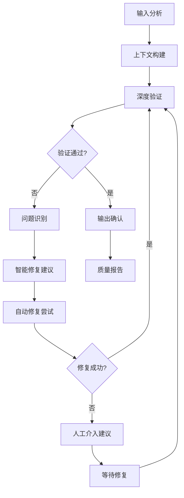

# Context Engineering Enhanced Validation System

**核心理念**: 将Context Engineering的验证循环与Spec Kit的质量保证深度融合
**自适应特性**: 基于项目复杂度、团队能力和风险级别动态调整验证深度

## 验证系统架构

### 多层验证框架
```yaml
验证层级:
  L1_语法验证: # 基础结构和格式检查
    - 文档结构完整性
    - 必需字段存在性
    - 格式规范一致性
    - 引用链接有效性
  
  L2_语义验证: # 内容逻辑和一致性检查
    - 需求逻辑一致性
    - 技术方案可行性
    - 依赖关系合理性
    - 时间估算准确性
  
  L3_上下文验证: # 项目特定的深度验证
    - 架构原则符合性
    - 现有系统兼容性
    - 团队技能匹配度
    - 业务目标对齐度
  
  L4_预测验证: # 基于AI的风险预测和优化建议
    - 潜在风险识别
    - 性能影响预测
    - 维护成本评估
    - 演进路径分析
```

### 自适应验证策略
```yaml
复杂度驱动:
  简单项目:
    - 启用: L1, L2基础检查
    - 重点: 快速验证，确保基本质量
    - 阈值: 宽松，允许快速迭代
  
  中等复杂:
    - 启用: L1, L2, L3部分检查
    - 重点: 平衡质量和效率
    - 阈值: 标准，确保稳定性
  
  高复杂度:
    - 启用: L1, L2, L3, L4全面检查
    - 重点: 深度验证，风险预防
    - 阈值: 严格，确保高质量
  
  关键系统:
    - 启用: 全部层级 + 额外安全检查
    - 重点: 极致验证，零容错
    - 阈值: 极严格，多重验证

风险驱动:
  低风险: 快速验证模式
  中风险: 标准验证模式
  高风险: 深度验证模式
  关键风险: 极致验证模式

团队驱动:
  新手团队: 详细指导 + 严格验证
  经验团队: 高效验证 + 智能建议
  专家团队: 最小验证 + 创新支持
```

## 验证循环实现

### Context Engineering验证循环


### 验证阶段详细实现

#### 阶段1: 输入分析和上下文构建
```yaml
输入分析:
  文档类型识别:
    - spec.md: 功能规范验证模式
    - plan.md: 技术方案验证模式
    - tasks.md: 任务规划验证模式
    - research.md: 研究文档验证模式
  
  复杂度评估:
    - 基于内容长度和结构复杂度
    - 分析技术栈和集成复杂度
    - 评估团队技能和项目风险
    - 确定适当的验证深度

上下文构建:
  项目上下文:
    - 加载项目配置和约束
    - 分析现有架构和模式
    - 收集相关的最佳实践
    - 构建验证知识库
  
  历史上下文:
    - 分析类似项目的验证结果
    - 学习常见问题和解决方案
    - 积累验证规则和阈值
    - 优化验证算法和策略
```

#### 阶段2: 多层深度验证
```yaml
L1_语法验证:
  结构检查:
    - 必需章节存在性验证
    - 章节顺序和层级检查
    - 格式规范一致性验证
    - 链接和引用有效性检查
  
  内容完整性:
    - 关键字段填充检查
    - 占位符替换完成度
    - 模板合规性验证
    - 文档版本一致性

L2_语义验证:
  逻辑一致性:
    - 需求间的逻辑关系检查
    - 技术方案的内部一致性
    - 时间估算的合理性验证
    - 资源分配的可行性检查
  
  可实现性验证:
    - 技术方案的可行性评估
    - 依赖关系的合理性检查
    - 性能要求的现实性验证
    - 安全要求的完整性检查

L3_上下文验证:
  架构兼容性:
    - 与现有架构的兼容性检查
    - 设计原则的符合性验证
    - 技术栈的一致性检查
    - 集成模式的合理性验证
  
  业务对齐:
    - 业务目标的对齐度检查
    - 用户需求的覆盖度验证
    - 优先级的合理性评估
    - ROI的可行性分析

L4_预测验证:
  风险预测:
    - 技术风险的识别和评估
    - 集成风险的预测和缓解
    - 性能风险的分析和优化
    - 安全风险的检测和防护
  
  优化建议:
    - 架构优化的机会识别
    - 性能优化的建议生成
    - 成本优化的方案提供
    - 维护性优化的策略建议
```

#### 阶段3: 智能问题识别和修复
```yaml
问题分类:
  严重问题: # 阻塞性问题，必须修复
    - 逻辑矛盾和冲突
    - 技术不可行性
    - 安全漏洞和风险
    - 架构违规和冲突
  
  重要问题: # 影响质量，建议修复
    - 性能潜在问题
    - 可维护性问题
    - 用户体验问题
    - 测试覆盖不足
  
  一般问题: # 优化机会，可选修复
    - 代码风格不一致
    - 文档不够详细
    - 命名不够清晰
    - 注释不够充分

智能修复:
  自动修复:
    - 格式和结构问题
    - 简单的逻辑错误
    - 明显的遗漏内容
    - 标准化的改进
  
  建议修复:
    - 复杂的逻辑问题
    - 架构设计问题
    - 性能优化机会
    - 安全加固建议
  
  人工修复:
    - 业务逻辑决策
    - 创新性解决方案
    - 复杂的权衡选择
    - 战略性技术决策
```

## 验证规则引擎

### 规则定义框架
```yaml
规则类型:
  结构规则:
    - 必需章节检查
    - 格式规范验证
    - 链接有效性检查
    - 版本一致性验证
  
  内容规则:
    - 关键信息完整性
    - 逻辑一致性检查
    - 可行性评估
    - 质量标准符合性
  
  上下文规则:
    - 项目特定约束
    - 架构原则符合性
    - 团队能力匹配
    - 业务目标对齐
  
  预测规则:
    - 风险识别模式
    - 性能影响预测
    - 维护成本评估
    - 演进路径分析

规则配置:
  严重性级别:
    - ERROR: 必须修复的严重问题
    - WARNING: 建议修复的重要问题
    - INFO: 可选优化的一般建议
    - HINT: 最佳实践的提示信息
  
  适用范围:
    - 全局规则: 适用于所有项目
    - 类型规则: 适用于特定项目类型
    - 团队规则: 适用于特定团队
    - 项目规则: 适用于特定项目
```

### 动态规则调整
```yaml
学习机制:
  反馈学习:
    - 收集用户对验证结果的反馈
    - 分析修复成功率和满意度
    - 调整规则权重和阈值
    - 优化验证算法和策略
  
  模式学习:
    - 分析成功项目的共同模式
    - 识别失败项目的问题模式
    - 提取最佳实践和反模式
    - 更新验证规则和建议
  
  上下文学习:
    - 学习不同项目类型的特点
    - 适应不同团队的工作方式
    - 理解不同技术栈的约束
    - 优化针对性的验证策略

自适应调整:
  实时调整:
    - 基于当前验证结果调整后续规则
    - 根据问题严重性动态调整阈值
    - 基于修复成功率优化建议策略
    - 根据用户反馈实时优化体验
  
  长期优化:
    - 基于历史数据优化规则权重
    - 根据成功模式更新最佳实践
    - 基于失败案例加强风险检测
    - 持续改进验证算法和策略
```

## 质量门控系统

### 多级质量门控
```yaml
门控级别:
  Bronze门控: # 基础质量保证
    - 通过L1语法验证
    - 无严重结构问题
    - 基本完整性满足
    - 允许进入下一阶段
  
  Silver门控: # 标准质量保证
    - 通过L1+L2验证
    - 无严重逻辑问题
    - 可行性基本确认
    - 质量达到发布标准
  
  Gold门控: # 高质量保证
    - 通过L1+L2+L3验证
    - 上下文完全兼容
    - 架构设计优秀
    - 质量达到生产标准
  
  Platinum门控: # 极致质量保证
    - 通过全部验证层级
    - 预测风险可控
    - 优化建议采纳
    - 质量达到企业标准

门控策略:
  渐进式门控:
    - 每个阶段都有对应的质量门控
    - 只有通过当前门控才能进入下一阶段
    - 支持降级门控以适应紧急情况
    - 提供门控豁免机制和审批流程
  
  自适应门控:
    - 基于项目风险级别调整门控严格度
    - 根据团队能力调整门控要求
    - 基于时间压力调整门控策略
    - 支持自定义门控规则和阈值
```

### 质量度量和报告
```yaml
质量指标:
  完整性指标:
    - 必需内容覆盖率
    - 关键信息完整度
    - 文档结构完整性
    - 验收标准明确度
  
  一致性指标:
    - 内部逻辑一致性
    - 架构设计一致性
    - 命名规范一致性
    - 风格标准一致性
  
  可行性指标:
    - 技术方案可行性
    - 时间估算准确性
    - 资源分配合理性
    - 风险评估充分性
  
  优化指标:
    - 性能优化程度
    - 安全加固程度
    - 可维护性程度
    - 可扩展性程度

报告生成:
  实时报告:
    - 验证进度和状态
    - 问题识别和分类
    - 修复建议和优先级
    - 质量趋势和预测
  
  阶段报告:
    - 阶段质量总结
    - 关键问题和风险
    - 改进建议和计划
    - 下阶段准备状态
  
  项目报告:
    - 整体质量评估
    - 最佳实践总结
    - 经验教训提取
    - 持续改进建议
```

## 集成接口设计

### 与Spec Kit命令集成
```yaml
/specify集成:
  验证时机:
    - 规范生成后自动验证
    - 用户请求时手动验证
    - 澄清完成后重新验证
  
  验证内容:
    - 功能需求完整性和一致性
    - 用户故事可测试性和明确性
    - 验收标准可衡量性和具体性
    - 技术约束合理性和可行性

/plan集成:
  验证时机:
    - 计划生成后自动验证
    - 设计文档更新后验证
    - 技术决策变更后验证
  
  验证内容:
    - 技术方案可行性和一致性
    - 架构设计合理性和扩展性
    - 数据模型完整性和规范性
    - API设计一致性和可用性

/tasks集成:
  验证时机:
    - 任务生成后自动验证
    - 任务更新后重新验证
    - 依赖关系变更后验证
  
  验证内容:
    - 任务覆盖度和完整性
    - 依赖关系合理性和可行性
    - 时间估算准确性和现实性
    - 验收标准明确性和可测试性
```

### API接口设计
```yaml
验证API:
  POST /validate:
    输入:
      - document_type: 文档类型
      - content: 文档内容
      - context: 项目上下文
      - options: 验证选项
    输出:
      - validation_result: 验证结果
      - issues: 问题列表
      - suggestions: 修复建议
      - quality_score: 质量评分
  
  GET /validate/rules:
    输出:
      - available_rules: 可用规则列表
      - rule_categories: 规则分类
      - customization_options: 自定义选项
  
  POST /validate/rules:
    输入:
      - rule_config: 规则配置
      - scope: 适用范围
    输出:
      - success: 配置结果
      - rule_id: 规则标识

修复API:
  POST /fix/auto:
    输入:
      - document_content: 文档内容
      - issues: 问题列表
      - fix_options: 修复选项
    输出:
      - fixed_content: 修复后内容
      - applied_fixes: 应用的修复
      - remaining_issues: 剩余问题
  
  GET /fix/suggestions:
    输入:
      - issue_id: 问题标识
      - context: 上下文信息
    输出:
      - suggestions: 修复建议列表
      - examples: 示例代码
      - best_practices: 最佳实践
```

## 使用示例

### 自动验证模式
```bash
# 在/specify命令中自动启用验证
/specify 用户认证系统 --validate=auto

# 在/plan命令中启用深度验证
/plan --validate=deep

# 在/tasks命令中启用并行验证
/tasks --validate=parallel
```

### 手动验证模式
```bash
# 验证特定文档
/validate spec.md --level=gold

# 验证整个功能目录
/validate ./specs/user-auth/ --comprehensive

# 自定义验证规则
/validate plan.md --rules=security,performance
```

### 验证报告示例
```markdown
🔍 Context Engineering 验证报告
📁 文档: /specs/user-auth/spec.md
🎯 验证级别: Gold (L1+L2+L3)
⏱️ 验证时间: 2.3秒

✅ 验证结果: 通过 (质量评分: 87/100)

📊 详细分析:
   L1 语法验证: ✅ 通过 (100%)
   L2 语义验证: ✅ 通过 (92%)
   L3 上下文验证: ⚠️  警告 (78%)
   L4 预测验证: 💡 建议 (85%)

⚠️ 发现问题 (2个):
   1. [WARNING] 用户故事#3缺少具体的验收标准
      → 建议: 添加可量化的成功指标
      → 示例: "用户能在30秒内完成登录流程"
   
   2. [INFO] 密码复杂度要求可以更具体
      → 建议: 参考NIST密码指南
      → 链接: https://pages.nist.gov/800-63-3/

💡 优化建议 (3个):
   1. 考虑添加渐进式Web应用(PWA)支持
   2. 建议集成单点登录(SSO)预留接口
   3. 可以考虑添加生物识别认证选项

🎯 下一步行动:
   ✅ 可以继续执行 /plan 命令
   📝 建议先修复WARNING级别的问题
   💡 可选择采纳优化建议以提升质量
```

---

**注意**: 此验证系统设计为完全可选和渐进式的，不会破坏现有的Spec Kit工作流程，同时提供强大的质量保证和智能优化能力。